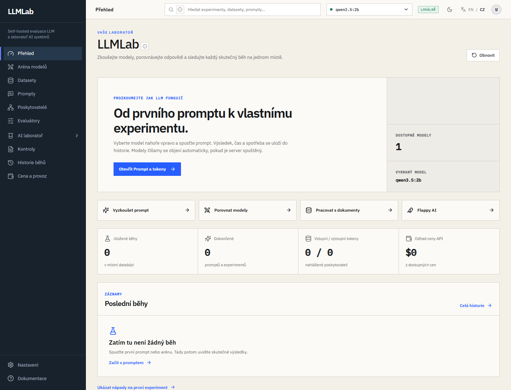
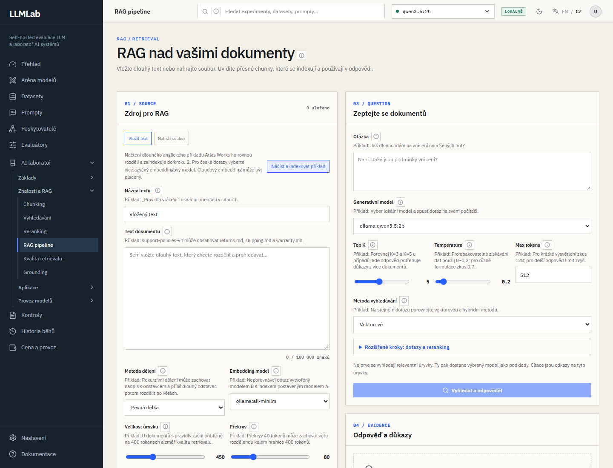

# LLMLab

Lokální laboratoř pro pochopení a porovnávání jazykových modelů. Píšete skutečným modelům, ukládáte běhy a můžete zkoumat, jak se mění odpovědi při jiném promptu, nastavení, zdrojích nebo agentovi. U polí vidíte krátké příklady; živé volání modelu se spustí až po kliknutí.

[English](README.md)

## Náhled aplikace

Snímky vznikly v čistém profilu prohlížeče s ukázkovým katalogem lokálních modelů a prázdnými seznamy běhů i dokumentů. Neobsahují osobní běhy ani přístupové údaje.

**Přehled:** vstup do laboratoří, uložené běhy, spotřeba tokenů a odhad ceny API.



**RAG pipeline:** příprava dokumentu, nastavení dělení a modelů, odpověď vedle nalezených podkladů.



## Spuštění bez Dockeru

Potřebujete **Python 3.12+**, **Node.js 22+**, `pnpm`, `uv` a spuštěnou [Ollamu](https://ollama.com/). Ollama je samostatný server. LLMLab ji nespouští a nestahuje modely automaticky.

Pro první lokální pokus stáhněte jeden generativní a jeden embeddingový model:

```powershell
ollama pull qwen3.5:9b
ollama pull all-minilm
python start.py
```

Otevřete **http://127.0.0.1:3000**. API dokumentace je na **http://127.0.0.1:8000/docs**. Příkaz nainstaluje zamknuté projektové závislosti, spustí FastAPI a Next.js a uloží data do `.local-data/lab.sqlite3`. Ukončíte jej `Ctrl+C`. Při nedostupné Ollamě aplikace ukáže její skutečný stav a nebude vymýšlet odpověď.

Vpravo nahoře vyberte některý z dostupných modelů Ollamy. V části **Prompt a tokeny** napište vlastní dotaz a klikněte na **Spustit**. Model, vstup, nastavení, odpověď, čas a nahlášené tokeny najdete v **Historii běhů**.

## Sekce aplikace

V postranním menu jsou položky v tomto pořadí. **AI laboratoř** je rozbalovací skupina; **Nastavení** a **Dokumentace** jsou v patičce menu.

| Sekce | Adresa | Co v ní najdete |
| --- | --- | --- |
| Přehled | `/` | Vstup do promptu, arény, RAG a Flappy AI; počty skutečných běhů, tokeny, odhad ceny a poslední uložené běhy. |
| Aréna modelů | `/arena` | Jeden prompt nebo dataset nad několika dostupnými modely; srovnání odpovědí, času, tokenů a odhadované ceny. |
| Datasety | `/datasets` | Ruční tvorba i import případů z CSV, JSON a JSONL, volba kontrol a spuštění vyhodnocení. |
| Prompty | `/prompts` | Ukládání verzí promptů a prohlížení rozdílů mezi nimi. |
| Poskytovatelé | `/providers` | Přehled dostupnosti generativních a embeddingových poskytovatelů a test připojení. |
| Evaluátory | `/evaluators` | Vysvětlení metod skórování a poslední evaluace skutečných odpovědí. |
| AI laboratoř → Prompt a tokeny | `/ai-lab/prompt-tokens` | Spouštění promptů se systémovou instrukcí, teplotou, top-p, limitem výstupu, stop sekvencí a podporovaným JSON schématem; odhad i skutečná spotřeba tokenů. |
| AI laboratoř → Embeddingy | `/ai-lab/embeddings` | Převod dvou textů dostupným embeddingovým modelem na vektory a porovnání kosinové podobnosti. |
| AI laboratoř → RAG pipeline | `/ai-lab/rag` | Vložení textu nebo PDF, DOCX, TXT a Markdown souboru; kontrola chunků, indexace, nalezených úryvků, odpovědi a citací. Samotná citace nedokazuje správnost tvrzení. |
| AI laboratoř → Bezpečnost a injection | `/ai-lab/safety` | Pokusy s přímým i dokumentovým podvrženým pokynem, falešným klíčem a simulovanými operacemi; srovnání původní a filtrované odpovědi. |
| AI laboratoř → Agenti | `/ai-lab/agents` | Úkol pro agenta s omezenými simulovanými soubory, databází a kalkulačkou; viditelná stopa kroků a cena. |
| AI laboratoř → Flappy AI | `/ai-lab/flappy` | Vlastní hra i náhodný, pravidlový, LLM a trénovaný DQN agent na tratích se seedem; žebříček, checkpointy, rozhodnutí a replay. |
| Kontroly | `/reviews` | Ruční označení uložených odpovědí jako použitelných či nepoužitelných a uložení poznámky k běhu. |
| Historie běhů | `/history` | Uložené běhy, podrobné výsledky a vstup do jejich porovnání. |
| Cena a provoz | `/operations` | Běhy po dnech, tokeny podle modelů, stav poskytovatelů, ceník a známé odhady ceny API. Neznámá cena zůstává neznámá. |
| Nastavení | `/settings` | Místní preference a správa připojení poskytovatelů. |
| Dokumentace | `/docs` | Čtyři výukové cesty s 26 vedenými misemi a volitelnou misí Flappy AI. Každá mise propojuje předpověď, pokus a krátkou kontrolní otázku. |

Porovnání běhů má vlastní adresu `/experiments/compare`. Starší adresy `/experiments`, `/knowledge-base`, `/ai-lab/grounding` a `/ai-lab/training` přesměrovávají do současných sekcí.

## Cloudové modely

Klíče OpenAI, Anthropic a Gemini můžete zadat v **Nastavení → Cloudové API klíče**, nebo do serverového `.env` jako `OPENAI_API_KEY`, `ANTHROPIC_API_KEY`, `GEMINI_API_KEY`. Klíč se z API neposílá zpět do prohlížeče. Lokální Ollama API klíč nepotřebuje. Na stránce **Poskytovatelé** uvidíte aktuální dostupnost; seznam Ollama modelů vychází z `GET /api/tags`, nikoli z pevného výčtu v aplikaci.

Pro server kompatibilní s API OpenAI nastavte v serverovém `.env` `OPENAI_COMPATIBLE_BASE_URL`. Vyžaduje-li server ověření, přidejte `OPENAI_COMPATIBLE_API_KEY` v Nastavení nebo v `.env`.

Odhady cen používají pouze ověřené běžné textové API sazby. Může se lišit region, délka kontextu, cache, nástroje, multimédia a skutečná faktura. Aktuální zdroje ceníku: [OpenAI](https://developers.openai.com/api/docs/pricing), [Anthropic](https://platform.claude.com/docs/en/about-claude/pricing), [Gemini](https://ai.google.dev/gemini-api/docs/pricing). Model bez ověřené sazby lze používat, ale jeho cena se nezapočte jako nula.

## Vývoj a ověření

```powershell
pnpm --dir apps/web lint
pnpm --dir apps/web typecheck
pnpm --dir apps/web test
pnpm build
pnpm --dir apps/web exec playwright install chromium
pnpm test:e2e
uv run --project apps/api --extra dev pytest -q apps/api/tests
```

[CI](.github/workflows/ci.yml) při každém pushi a pull requestu spouští lint, kontrolu typů, unit testy, produkční build, Playwright na desktopu, tabletu a mobilu a backendové testy. Test navigace hlídá skupiny, pořadí, názvy, aktivní sekci a dostupnost každé odkazované stránky. Playwright v CI používá produkční build.

Frontend je Next.js 16/React 19, backend FastAPI/SQLAlchemy. Lokální spuštění používá SQLite; Docker Compose zůstává k dispozici pro PostgreSQL a Redis. `start.py` dává při spuštění přednost místní SQLite databázi, i když `.env` obsahuje Docker adresy. Uživatelské dokumenty, epizody a běhy se automaticky nenačítají z jiného projektu.

## Licence

Vlastní kód LLMLab je pod [licencí MIT](LICENSE). Knihovny třetích stran a fonty IBM Plex mají vlastní podmínky; jejich přehled je v [oznámeních o cizích knihovnách](THIRD_PARTY_NOTICES.md) a úplné texty v souborech pro [web](THIRD_PARTY_NODE_NOTICES.txt) a [API](THIRD_PARTY_PYTHON_NOTICES.txt). Docker image vytváří oznámení z balíčků pro svou konkrétní platformu.
