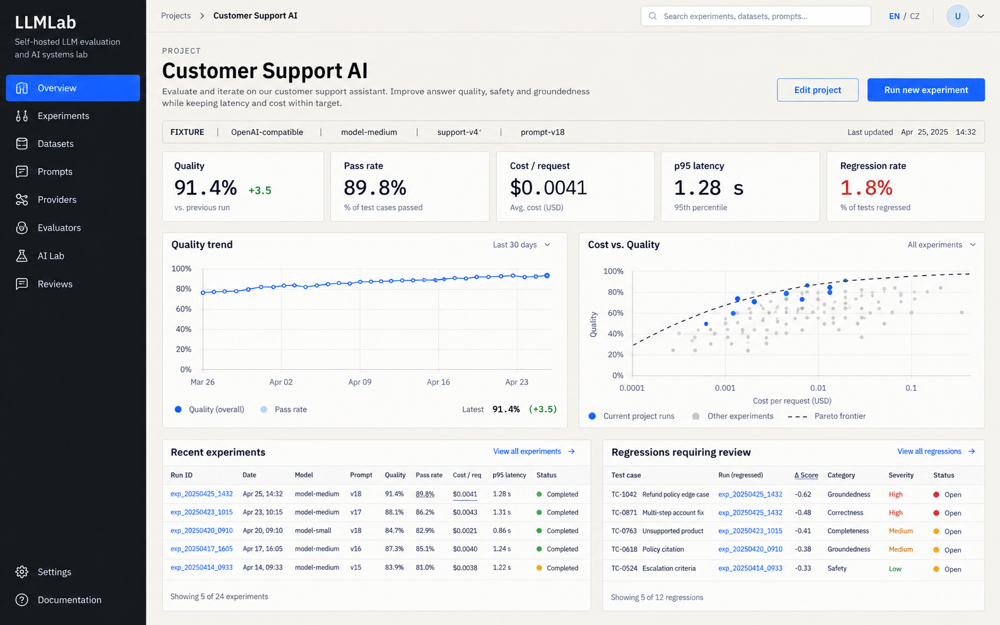

# LLMLab

**Self-hostovaný nástroj pro reprodukovatelnou evaluaci promptů, modelů, RAG pipeline a agentů.**

[English version](README.md) · [Architektonické rozhodnutí](docs/adr/0001-fixture-first.md) · [Poznámky ke zdrojům](docs/sources.md)

LLMLab pracuje se změnami AI systému jako se změnami softwaru: verzuj vstupy, spusť řízený experiment, prohlédni jednotlivá selhání a zachovej přesný původ každého výsledku. Deterministický režim Ukázka zpřístupňuje celý produkt bez API klíčů a placených požadavků.

## Skutečný vícejazyčný RAG

RAG, Embeddingy, Grounding a Znalostní báze používají trackovaný syntetický anglický corpus
fiktivní organizace Atlas Works. České i anglické otázky procházejí skutečným lokálním vektorovým +
BM25 retrievelam; pouze Fixture generování je deterministické. Modely, režimy, životní cyklus
indexu, soukromí, API, přidání dokumentu a omezení popisuje
[průvodce vícejazyčným RAG](docs/multilingual-rag.md).

## Co LLMLab umí

- Porovnávat varianty promptů a modelů nad stejným neměnným datasetem.
- Zobrazovat kvalitu, úspěšnost, latenci, cenu, regrese a párové případy.
- Kontrolovat retrieval, reranking, důkazy, tvrzení a grounding RAG pipeline.
- Sledovat volání nástrojů agenta bez odhalování soukromého chain-of-thought.
- Testovat prompt injection a workflow lidské kontroly.
- Spouštět omezený lokální trénink a sledovat loss, gradienty, validaci a overfitting.
- Přepínat mezi režimy Ukázka, lokálním Ollama a nakonfigurovanými cloudovými poskytovateli.
- Používat celé rozhraní česky nebo anglicky, ve světlém i tmavém tématu.

## Stav projektu

LLMLab je produkčně orientovaná referenční implementace, ne hostovaná služba. Repozitář obsahuje UI, API kontrakty, perzistenci, frontu úloh, testy, Docker služby a deterministické ukázkové workflow.

| Funkce | Stav |
| --- | --- |
| Ukázkové evaluační workflow | Kompletní a deterministické |
| Lokální generování přes Ollama | Dostupné po konfiguraci |
| OpenAI, Anthropic, Gemini a kompatibilní API | Dostupné po nastavení serverových klíčů |
| PostgreSQL a Redis/Celery | Součást Docker Compose |
| Živý RAG nad vlastní vektorovou kolekcí | Vyžaduje integraci |
| Dávkové experimenty s živými poskytovateli | Vyžadují integraci |
| Autentizace, autorizace, rate limiting a zálohy | Odpovědnost nasazení |

Ukázkové hodnoty jsou vždy označené. LLMLab nevydává předvyplněný výsledek za živou odpověď modelu.

## Rychlé spuštění přes Docker

Požadavek: Docker Engine s Docker Compose.

~~~powershell
Copy-Item .env.example .env
docker compose up --build
~~~

Na Linuxu nebo macOS:

~~~bash
cp .env.example .env
docker compose up --build
~~~

Otevři [http://localhost:3000](http://localhost:3000). API klíč není potřeba.

- Webové UI: http://localhost:3000
- API a OpenAPI: http://localhost:8000 a http://localhost:8000/docs
- PostgreSQL s pgvector: localhost:5432
- Redis: localhost:6379

Zastavení:

~~~bash
docker compose down
~~~

Přidej **--volumes** pouze tehdy, když chceš záměrně odstranit lokální data PostgreSQL a Redis.

## Režimy spuštění

| Režim | Účel | Síť a cena |
| --- | --- | --- |
| **Ukázka** | Reprodukovatelné procházení a testy | Bez klíče a placeného požadavku |
| **Lokálně** | Generování a embeddingy přes Ollama | Zůstává na nakonfigurovaném Ollama hostu |
| **Cloud** | OpenAI, Anthropic, Gemini nebo kompatibilní endpoint | Spouští se pouze po explicitní akci |

Každý výsledek ukládá režim, poskytovatele, model, konfiguraci, dostupné využití tokenů a čas. Klíče zůstávají v API službě a nikdy nesmí mít prefix **NEXT_PUBLIC_**.

## Architektura

~~~text
Prohlížeč
  |
  +-- Next.js 16 / React 19
  |       |
  |       +-- proxy /api/v1
  |
  +-- FastAPI
          +-- PostgreSQL + pgvector
          +-- Redis
          +-- Celery worker
          +-- adaptéry poskytovatelů
          +-- evaluátory a RAG kontrakty
          +-- Server-Sent Events pro průběh běhu
~~~

Web při nedostupném API použije vestavěná ukázková data. Docker Compose zpřístupní kompletní cestu s perzistencí, frontou a streamováním událostí.

## Struktura repozitáře

~~~text
apps/
  web/          Next.js UI a Playwright testy
  api/          FastAPI, migrace, worker a pytest testy
packages/
  cli/          Python klient pro API
config/         Verzovaná metadata cen modelů
design/         Vizuální směr, mockupy a prompty obrázků
docs/           Architektonická rozhodnutí a zdroje
examples/       Reprodukovatelné definice experimentů
~~~

## Lokální vývoj

Požadavky:

- Node.js 22 nebo novější
- pnpm 11.19
- Python 3.12 nebo novější
- [uv](https://docs.astral.sh/uv/)
- PostgreSQL a Redis, případně Docker

Spusť web:

~~~bash
pnpm install
pnpm dev
~~~

V dalším terminálu spusť API:

~~~bash
cd apps/api
uv sync --extra training --extra dev
uv run uvicorn llmlab_api.main:app --reload
~~~

Výchozí adresy jsou http://localhost:3000 pro UI a http://localhost:8000 pro API.

## Konfigurace

Zkopíruj **.env.example** do **.env**.

| Proměnná | Účel |
| --- | --- |
| DATABASE_URL | Připojení PostgreSQL pro API |
| REDIS_URL | Redis broker |
| OPENAI_API_KEY | Volitelný přístup k OpenAI |
| ANTHROPIC_API_KEY | Volitelný přístup k Anthropic |
| GEMINI_API_KEY | Volitelný přístup ke Gemini |
| OPENAI_COMPATIBLE_BASE_URL | Volitelné kompatibilní API |
| OPENAI_COMPATIBLE_API_KEY | Klíč kompatibilního API |
| OLLAMA_BASE_URL | Lokální Ollama endpoint |
| GIT_SHA | Revize ukládaná do metadat reprodukovatelnosti |

Nikdy necommituj **.env**. Verzovaný **.env.example** obsahuje pouze bezpečné zástupné hodnoty a lokální výchozí nastavení.

## Ověření

Web:

~~~bash
pnpm lint
pnpm typecheck
pnpm test
pnpm test:e2e
pnpm build
~~~

API:

~~~bash
cd apps/api
uv run ruff check .
uv run mypy llmlab_api
uv run pytest
~~~

Výchozí testy neprovádějí placené požadavky. Testy živých poskytovatelů musí zůstat volitelné.

## Kontrolní seznam pro produkci

Před zpřístupněním mimo důvěryhodnou lokální síť:

- Změň lokální databázová hesla.
- Přidej TLS a autentizovanou reverzní proxy.
- Doplň autentizaci, autorizaci a izolaci tenantů.
- Omez CORS na nasazené domény.
- Ulož klíče do správce tajemství a pravidelně je rotuj.
- Nastav zálohy databáze, retenci a test obnovy.
- Přidej rate limiting, limity velikosti požadavků, auditní log a alerty.
- Připni a skenuj obrazy kontejnerů i závislosti.
- Urči retenci promptů, dokumentů, výstupů modelů a lidských kontrol.
- Ověř limity evaluátorů na vlastních datech před použitím jako release gate.

## Licence

Projekt je dostupný pod [MIT licencí](LICENSE).
