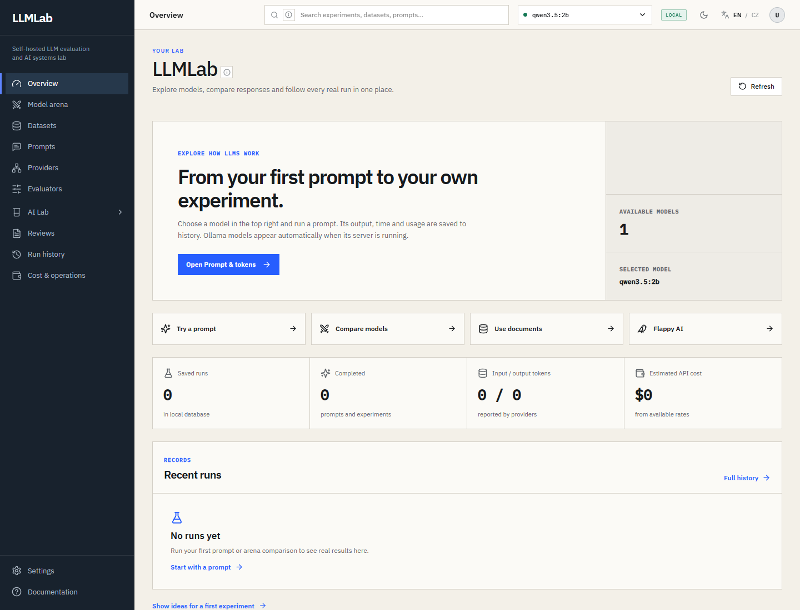
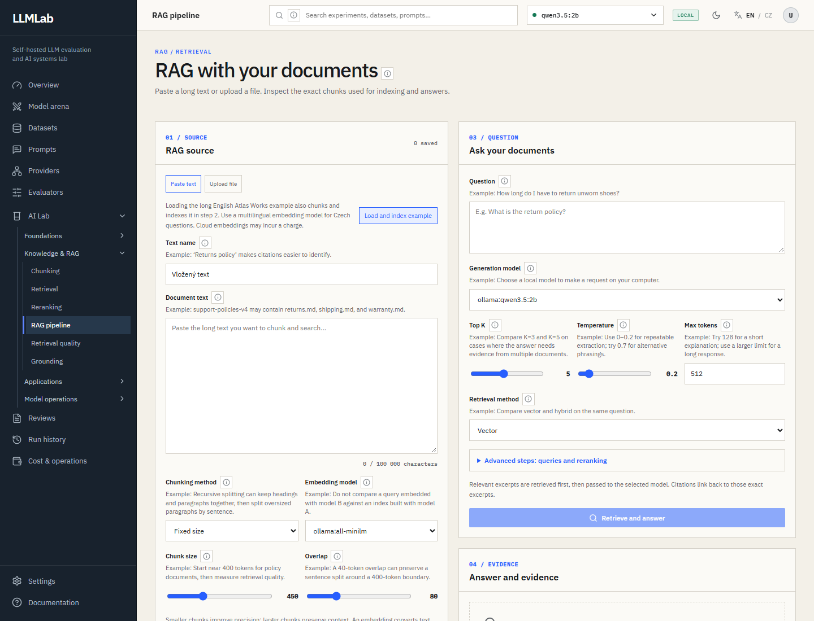

# LLMLab

A local workbench for learning how language models behave, comparing real responses, and inspecting the evidence behind a run. Fields show short examples; live model requests run only after you click.

[Česká verze](README.cs.md)

## Preview

These screenshots use a clean browser profile, an illustrative local model catalog, and empty run and document lists. They contain no personal runs or credentials.

**Overview:** start a lab and inspect saved runs, token usage, and estimated API cost.



**RAG pipeline:** prepare a document, choose chunking and models, then inspect the answer beside its evidence.



## Start locally

Install Python 3.12+, Node.js 22+, `pnpm`, `uv`, and [Ollama](https://ollama.com/). Ollama runs separately; LLMLab discovers the models you have installed.

```powershell
ollama pull qwen3.5:9b
ollama pull all-minilm
python start.py
```

Open **http://127.0.0.1:3000**. The API reference is at **http://127.0.0.1:8000/docs**. The start command installs the locked dependencies, launches the API and web app, and stores local data in `.local-data/lab.sqlite3`. Stop it with `Ctrl+C`.

Pick an available model at the top right, then try **Prompts & tokens**. Your input, model settings, response, timing, and reported token usage are saved under **Run history**.

## Sections

The sidebar keeps these destinations in this order. **AI Lab** is an expandable group; **Settings** and **Documentation** sit in the footer.

| Section | Route | What it does |
| --- | --- | --- |
| Overview | `/` | Start from a prompt, arena, RAG, or Flappy AI; inspect real run counts, token usage, estimated cost, and recent saved runs. |
| Model arena | `/arena` | Send one prompt or dataset to several available models; compare answers, latency, token usage, and estimated cost. |
| Datasets | `/datasets` | Create and import CSV, JSON, or JSONL test cases, choose evaluation checks, and run them against a model. |
| Prompts | `/prompts` | Save and compare prompt versions and inspect differences between them. |
| Providers | `/providers` | See available generation and embedding providers and test their connections. |
| Evaluators | `/evaluators` | Learn the scoring methods and inspect the latest evaluation from real model answers. |
| AI Lab → Prompt & Tokens | `/ai-lab/prompt-tokens` | Run prompts with system instructions, temperature, top-p, output limits, stop sequences, and supported JSON schemas; inspect token estimates and actual usage. |
| AI Lab → Embeddings | `/ai-lab/embeddings` | Compare the vectors for two texts using an available embedding model and inspect cosine similarity. |
| AI Lab → RAG Pipeline | `/ai-lab/rag` | Paste text or upload PDF, DOCX, TXT, or Markdown; inspect chunking, indexing, retrieval, answer excerpts, and citations. Citations alone do not establish factual support. |
| AI Lab → Safety & Injection | `/ai-lab/safety` | Try explained prompt injections and run three harmless probes against your own system prompt. |
| AI Lab → Agents | `/ai-lab/agents` | Inspect simulated tools or let an agent read LLMLab documents and datasets. Every write to a document, dataset, or note pauses for one-step approval. |
| AI Lab → Flappy AI | `/ai-lab/flappy` | Play prepared challenges and inspect replay decisions with pause, step controls, and speed selection. |
| Reviews | `/reviews` | Mark saved model answers useful or not useful and store notes alongside the run. |
| Run history | `/history` | Browse saved runs and open comparisons and detailed results. |
| Cost & operations | `/operations` | Inspect daily runs, model token totals, provider status, price catalog, and known API cost estimates. Unknown prices remain unknown. |
| Settings | `/settings` | Change local preferences, check API and model readiness, and export or restore a complete lab backup. |
| Documentation | `/docs` | Follow guided missions, inspect a progress map based on real runs, and add personal glossary notes. |

## Lab backups

Use **Settings → Back up the entire lab** to download a versioned ZIP with database records, saved browser preferences and learning notes, uploaded document originals when available, and the Flappy DQN checkpoint. API keys, `.env`, and downloaded models are excluded. Select a ZIP to inspect its contents. **Back up and restore** downloads the current state first, then replaces local data. Restoration validates checksums and database shape before writing; failed database imports roll back. Documents created before original-file storage retain their extracted text and index, but cannot offer the old original for download.

The local API exposes `/api/v1/backups/export`, `/inspect`, and `/restore`; `/api/v1/preflight`; document version routes under `/api/v1/user-documents/{id}/versions`; `/api/v1/agent/runs/{id}/approval`; and `/api/v1/agent/safety/assessments`. These routes also appear in the API reference at `http://127.0.0.1:8000/docs`.

The run comparison has its own route at `/experiments/compare`. Older links to `/experiments`, `/knowledge-base`, `/ai-lab/grounding`, and `/ai-lab/training` redirect to their current sections.

## Cloud models and cost

Add OpenAI, Anthropic, or Gemini credentials under **Settings → Cloud API keys**, or set `OPENAI_API_KEY`, `ANTHROPIC_API_KEY`, and `GEMINI_API_KEY` in the server `.env`. The API never returns a stored secret to the browser. Local Ollama requires no key. The model picker reflects the current `GET /api/tags` response from Ollama and configured cloud providers.

For an OpenAI-compatible server, set `OPENAI_COMPATIBLE_BASE_URL` in the server `.env`. If that server requires authentication, add `OPENAI_COMPATIBLE_API_KEY` in Settings or `.env`.

Prices are conservative estimates for listed standard text API rates, not invoices. Context tiers, cached usage, tools, regions, and multimodal input may change the actual charge. See the [OpenAI](https://developers.openai.com/api/docs/pricing), [Anthropic](https://platform.claude.com/docs/en/about-claude/pricing), and [Gemini](https://ai.google.dev/gemini-api/docs/pricing) price lists.

## Development

```powershell
pnpm --dir apps/web lint
pnpm --dir apps/web typecheck
pnpm --dir apps/web test
pnpm build
pnpm --dir apps/web exec playwright install chromium
pnpm test:e2e
uv run --project apps/api --extra dev pytest -q apps/api/tests
```

[CI](.github/workflows/ci.yml) runs lint, type checks, unit tests, a production build, Playwright checks at desktop, tablet, and mobile sizes, and API tests on every push and pull request. The navigation test protects the sidebar groups, order, labels, active section, and every linked route. Playwright runs against the production build in CI.

The frontend uses Next.js 16 and React 19. The API uses FastAPI and SQLAlchemy. `start.py` uses local SQLite even when `.env` contains Docker service addresses. Docker Compose remains available for PostgreSQL and Redis deployment, but is not needed for the local workflow. Existing records from another project are not imported automatically.

## License

LLMLab source code is under [MIT](LICENSE). Third-party packages and IBM Plex fonts retain their own terms; see [third-party notices](THIRD_PARTY_NOTICES.md) and the generated [web](THIRD_PARTY_NODE_NOTICES.txt) and [API](THIRD_PARTY_PYTHON_NOTICES.txt) license texts. Docker images regenerate notices for the exact platform packages they contain.
